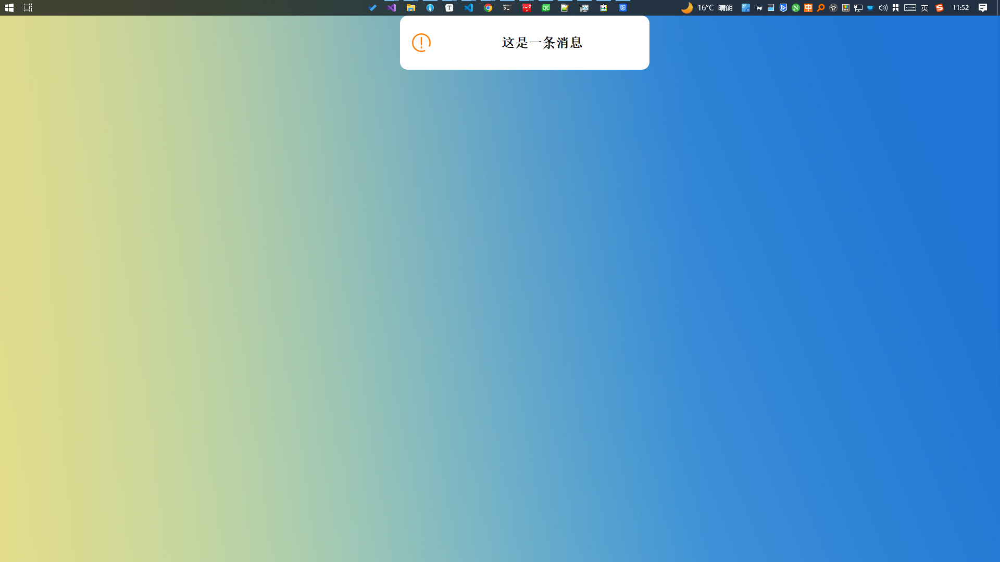

# Qt顶部弹出式消息框

#### 介绍
基于QWidget实现的顶部弹出式消息框

1. 显示位置

> 

2. 提示消息
> INFO
> 

3. 错误信息
> WARNING
> 

#### 团队使用说明文档

clone到本地之后在`setting`文件夹中找到`autoHooks.bat`，双击运行即可（注，是为了规范`git commit`的提交说明）

#### 使用说明

1. 在mainwindow函数新建`customMsg`对象

2. 调用`setBackgroundColor(QString)`设置背景颜色

3. 调用`setmsgType(messageType)`设置消息框类型
       

    

   | ENUM | CRITICAL                                                     | SUCCESS                                                      | WARNING                                                      | INFO                                                         |
   | ---- | ------------------------------------------------------------ | ------------------------------------------------------------ | ------------------------------------------------------------ | ------------------------------------------------------------ |
   | 图标 |  |  |  |  |

   

4. 调用`setContentText(QString)`设置消息框内容
